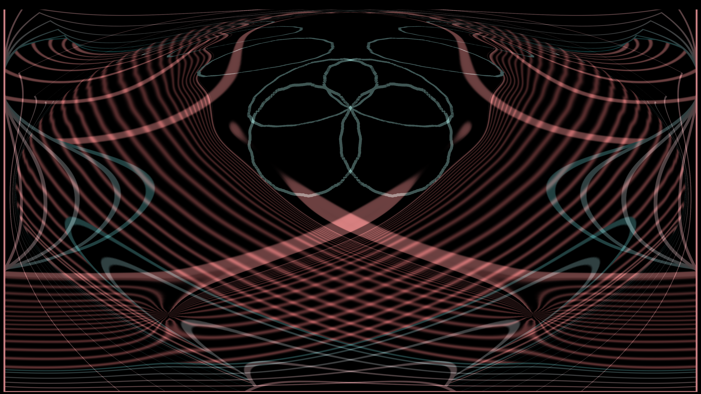
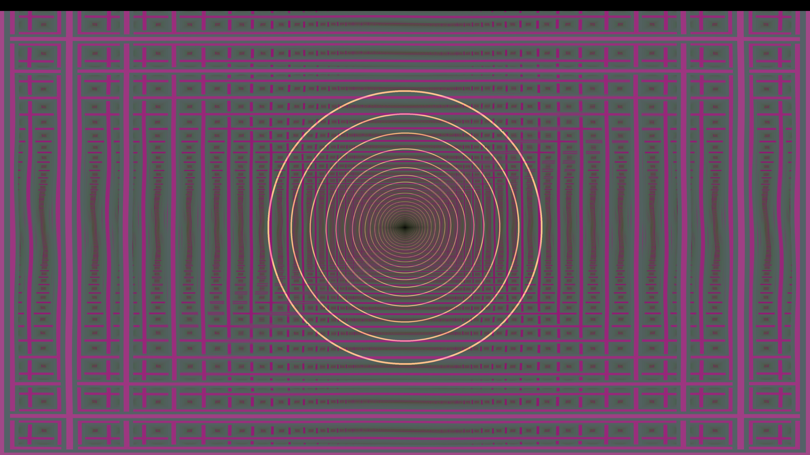
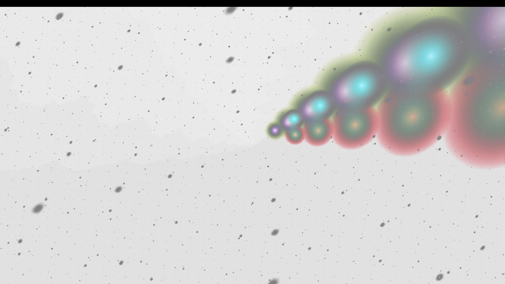

# Blackdrop

[](https://x.com/scottito22)

Blackdrop brings the nostalgia of classic Winamp visualizations to Omarchy as a modern fullscreen listen mode for any display. Its music-reactive motion, true-black silent state, and moving logo are OLED-friendly, so an OLED can stay on while you listen without parking static player chrome on the panel.



<details>
<summary>More visualization styles</summary>





</details>

## Use

Start Blackdrop by clicking the **droplet** on the right side of the Omarchy bar or pressing **Super+Shift+B**. It visualizes every app mixed into the PipeWire default sink on the currently focused display.

### Keyboard controls

| Key | Action |
|---|---|
| **← Left** | Previous visualization preset |
| **→ Right** | Next visualization preset |
| **↑ Up** | Save/lock the current preset so it stays selected |
| **↓ Down** | Unlock and enable **Random per song** |
| **Escape** | Exit Blackdrop and restore the previous app’s tiled/fullscreen state |
| **Super+Shift+B** | Toggle Blackdrop from anywhere |

Whenever the preset changes, Blackdrop shows its name and these arrow controls for two seconds. Twelve presets are included; the selected preset otherwise remains unchanged for the song.

## Behavior

- While open, Blackdrop inhibits idle, keeping the display and its audio path alive while preventing the stock screensaver and display-off path from taking over.
- With no sink signal it switches to the official neon-green Omarchy logo drifting on true black.
- While music plays, the visualization is unobstructed most of the time; roughly every four minutes, the neon Omarchy mark flashes for three detected beats. projectM’s M/headphone splash is skipped automatically.
- The curated presets use strong transient-relative audio equations: kick/drum energy drives zoom and decay flashes, while vocal-range mids/highs drive rotation, warp, and waveform scaling.
- The pointer is hidden while Blackdrop is open.
- If the one-time setup has not been run yet, Blackdrop shows a setup card naming exactly what is missing instead of a blank black screen.

The overlay follows the focused output and its scale, resolution, current refresh rate, and top/bottom/left/right bar placement.

## Install

Install Blackdrop from the Omarchy plugin marketplace, or run:

```bash
omarchy plugin add https://github.com/jcarcinogen/omarchy-blackdrop.git --enable
```

Blackdrop requires Omarchy 4 Quattro plus the repository `projectm` and `projectm-pulseaudio` packages. A plugin install only clones this repository, so the first time you open Blackdrop it shows a **setup card** instead of a bare black screen. The card lists exactly what is still missing and offers **Open Setup Terminal**, which finishes the one-time setup in a visible terminal window:

1. the repository `projectm` and `projectm-pulseaudio` packages that provide the visualization window;
2. Blackdrop’s reversible local configuration — the curated preset path, the **Super+Shift+B** toggle, and the projectM window rules.

Nothing in your configuration changes until you run that visible step. Blackdrop itself never asks for elevated privileges; the package step goes through Omarchy’s own `omarchy-pkg-add`, which authorizes in the normal pacman flow. The card clears itself as soon as setup succeeds.

To do the same thing by hand:

```bash
omarchy-pkg-add projectm projectm-pulseaudio
~/.config/omarchy/plugins/io.github.jcarcinogen.blackdrop/setup.sh
```

`setup.sh` is idempotent, so re-running it is the repair path. Check the current state at any time, without changing anything:

```bash
~/.config/omarchy/plugins/io.github.jcarcinogen.blackdrop/scripts/status.py
```

At each launch, Blackdrop detects the focused monitor and matches projectM’s render FPS to that monitor’s current refresh rate (60, 75, 120, 144, 165, 240 Hz, and so on). It never changes the monitor mode, modifies `$OMARCHY_PATH`, or replaces the Omarchy screensaver launcher.

## Remove

Run:

```bash
~/.config/omarchy/plugins/io.github.jcarcinogen.blackdrop/uninstall.sh
```

The remover disables the plugin, removes its owned keybinding/window-rule block, restores the prior projectM config, and deletes the plugin tree. It does not touch Omarchy's screensaver launcher and leaves the repository packages installed — remove those with `omarchy pkg remove projectm projectm-pulseaudio` if you want them gone.

## License

MIT. See [LICENSE](LICENSE) and [THIRD_PARTY.md](THIRD_PARTY.md) for the bundled preset credits.
